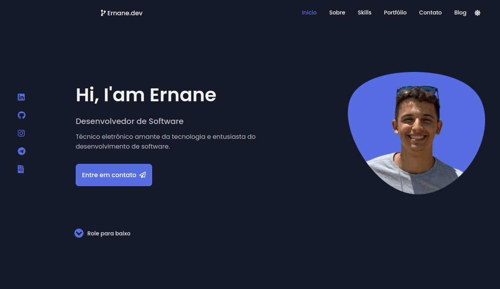

<h1 align="center">
  <strong>Ernane.dev (old)</strong>
</h1>

  <a href="#-Tecnologias">Technologies</a>&nbsp;&nbsp;&nbsp;|&nbsp;&nbsp;&nbsp;
  <a href="#-Projeto">Project</a>&nbsp;&nbsp;&nbsp;

 

  

  

## 🚀 Tecnologias

This site was developed with:
- Javascript
- Svelte
  
Check the complete list <a href="./package.json">here</a>.

## 💻 Projeto

Old site with some pertinent information and a brief portfolio of projects that make up my professional and academic career building.

<a href="https://github.com/ErnaneJ/ernane-dev"> New Website. </a> 

  Developed with ❤ by <a target="_blank" href="https://www.ernane.dev/">Ernane Ferreira</a>. 👋🏻 

